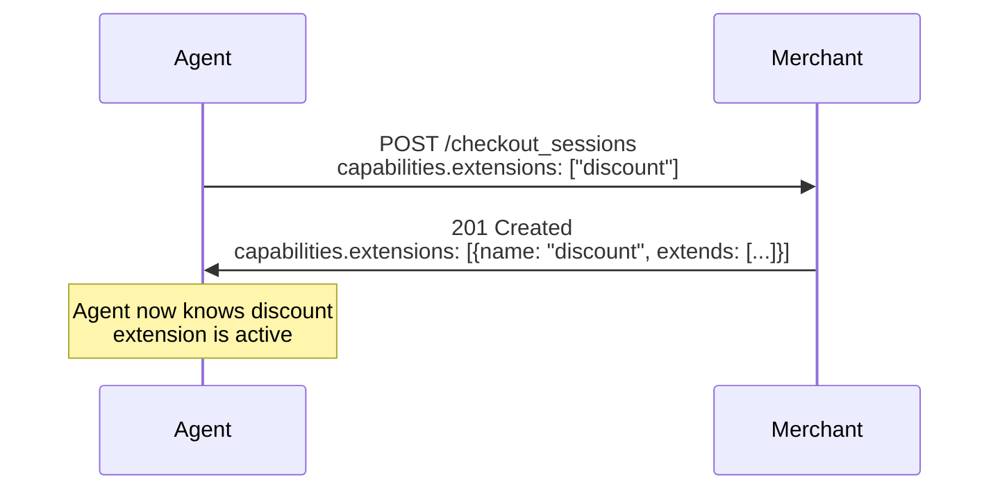

# RFC: ACP Extensions Framework

**Status:** Draft
**Version:** 2026-01-27
**Scope:** Extension mechanism for optional, composable capabilities

This RFC defines the **ACP Extensions Framework**, a mechanism that enables
merchants to advertise and platforms to discover optional capabilities that
extend the core checkout specification. Extensions integrate with the existing
capability negotiation system. The first extension defined under this framework
is the **Discount Extension**.

---

## 1. Scope & Goals

- Provide a **standardized extension mechanism** for ACP that enables optional
  capabilities without breaking backward compatibility.
- Integrate with the existing **capability negotiation** pattern, using the
  unified `capabilities` object for discovery.
- Enable **schema clarity** so platforms know which parts of the API each
  extension affects.
- Define a **Discount Extension** as the first implementation, delivering
  rich discount and promotion support.

**Out of scope:** Extension registration/discovery services, extension
marketplaces, dynamic extension loading at runtime.

### 1.1 Normative Language

The key words **MUST**, **MUST NOT**, **SHOULD**, **MAY** follow RFC 2119/8174.

---

## 2. Motivation

### 2.1 Enabling Optional Capabilities

This framework introduces a formal extension mechanism for ACP. It provides
standardized patterns for:

- Merchants to **advertise** which optional capabilities they support
- Platforms to **discover and negotiate** capabilities before checkout
- New capabilities to be **added composably** without modifying the core specification

### 2.2 Integration with Capability Negotiation

Extensions integrate with the existing capability negotiation system (see
[RFC: Capability Negotiation](./rfc.capability_negotiation.md)):

- Agents declare supported extensions in request `capabilities.extensions`
- Merchants respond with active extensions in response `capabilities.extensions`

The same `capabilities` object is used for both requests and responses; context
determines which party is declaring.

### 2.3 Discount Extension

The Discount Extension enhances the existing `coupons` array with:

- **Rich response structure** for applied discounts
- **Allocation details** showing where discounts were applied
- **Automatic discount support** for merchant-initiated promotions
- **Comprehensive error codes** for rejection reasons

---

## 3. Extension Declaration

### 3.1 Response Format

Merchants advertise extension support in the checkout response via
`capabilities.extensions`:

```json
{
  "id": "checkout_session_123",
  "status": "ready_for_payment",
  "capabilities": {
    "payment_methods": ["card"],
    "extensions": [
      {
        "name": "discount",
        "extends": ["checkout.request", "checkout.response"]
      }
    ]
  }
}
```

### 3.2 Request Format

Agents **MAY** indicate which extensions they support in the request:

```json
{
  "line_items": [{"id": "item_123", "quantity": 1}],
  "capabilities": {
    "extensions": ["discount", "loyalty"]
  }
}
```

When an agent declares supported extensions, merchants **SHOULD** activate
those extensions if available.

### 3.3 Extension Object

Each extension in the response `capabilities.extensions` is an object:

| Field | Type | Required | Description |
|-------|------|----------|-------------|
| `name` | string | Yes | Unique identifier for the extension |
| `extends` | string[] | No | Which parts of the API this extension affects |
| `schema` | string | No | URL to the extension's JSON Schema |
| `spec` | string | No | URL to the extension's specification document |

### 3.4 The `extends` Field

The `extends` array clarifies which parts of the request/response are affected:

| Value | Description |
|-------|-------------|
| `checkout.request` | Adds fields to create/update checkout request body |
| `checkout.response` | Adds fields to checkout session response body |
| `checkout.complete.request` | Adds fields to complete checkout request |
| `checkout.complete.response` | Adds fields to complete checkout response |

**Example:** The discount extension affects both requests and responses:

```json
{
  "name": "discount",
  "extends": ["checkout.request", "checkout.response"]
}
```

### 3.5 Extension Identifiers

Extension identifiers are lowercase strings. Core ACP extensions use simple names:

| Extension | Identifier | Description |
|-----------|------------|-------------|
| Discount | `discount` | Discount code support with rich applied discounts |
| Fulfillment | `fulfillment` | Extended fulfillment options (future) |
| Loyalty | `loyalty` | Loyalty points and rewards (future) |
| Subscription | `subscription` | Recurring billing support (future) |

Third-party extensions **SHOULD** use reverse-domain naming to avoid conflicts:

```json
{
  "extensions": [
    {"name": "discount"},
    {"name": "com.example.custom-extension", "schema": "https://example.com/schema.json"}
  ]
}
```

---

## 4. Extension Negotiation

Extension negotiation follows the same pattern as capability negotiation:



1. **Agent Request**: Agent sends `capabilities.extensions` listing
   extensions it understands.

2. **Merchant Response**: Merchant includes `capabilities.extensions`
   with active extension objects for this session.

3. **Schema Resolution**: Agent interprets response using base schema
   composed with active extension schemas.

### 4.1 Backward Compatibility

- The `extensions` array in `capabilities` is **OPTIONAL**
- Merchants not supporting extensions omit the array
- Agents **MUST** handle responses with or without extensions
- Extension-specific fields are ignored by clients that don't support them

---

## 5. Extension Schema Composition

### 5.1 Pattern

Extensions add fields to the base checkout schema using JSON Schema
composition. Each extension defines:

1. **New field definitions** added to the checkout object
2. **New types** used by those fields
3. **Error codes** for extension-specific messages

### 5.2 Example: Discount Extension

The discount extension adds a `discounts` object to the checkout:

```json
{
  "$defs": {
    "discounts_object": {
      "type": "object",
      "properties": {
        "codes": {
          "type": "array",
          "items": { "type": "string" }
        },
        "applied": {
          "type": "array",
          "items": { "$ref": "#/$defs/applied_discount" }
        }
      }
    }
  }
}
```

### 5.3 Composition Rules

- Extensions **MUST NOT** modify existing required fields
- Extensions **MUST NOT** change the semantics of existing fields
- Extensions **MAY** add new optional fields to the checkout object
- Extensions **MAY** add new values to the `messages[].code` enum

---

## 6. Extension Lifecycle

### 6.1 States

Extensions follow this lifecycle:

| State | Description |
|-------|-------------|
| `draft` | Extension under development, not for production use |
| `experimental` | Extension available for testing, may change |
| `stable` | Extension is production-ready and versioned |
| `deprecated` | Extension is being phased out |
| `retired` | Extension is no longer supported |

### 6.2 Versioning

Extensions version independently from the core protocol. Extension versions
use the same YYYY-MM-DD format:

```json
{
  "capabilities": {
    "extensions": [
      {"name": "discount@2026-01-27", "extends": ["checkout.request", "checkout.response"]}
    ]
  }
}
```

If no version is specified, the latest stable version is assumed.

---

## 7. Security Considerations

- Extensions **MUST NOT** introduce new authentication or authorization
  mechanisms that bypass the core protocol's security model
- Extension-specific data follows the same PCI/PII handling rules as core data
- Merchants **MUST** validate extension inputs with the same rigor as core
  fields

---

## 8. Reference Implementation

See the following files for the reference implementation:

- `spec/unreleased/json-schema/schema.extension.json` - Extension schema
- `spec/unreleased/json-schema/schema.discount.json` - Discount extension
- `spec/unreleased/openapi/openapi.agentic_checkout.yaml` - Updated API spec

---

## 9. Conformance Checklist

- [ ] Supports `capabilities.extensions` array in checkout responses
- [ ] Returns extension objects with `name` and optional `extends` field
- [ ] Handles `capabilities.extensions` in requests (optional)
- [ ] Ignores unknown extension fields gracefully
- [ ] Validates extension-specific inputs
- [ ] Returns extension-specific error codes in `messages[]`

---

## 10. Change Log

- **2026-01-27**: Initial draft defining extensions framework

